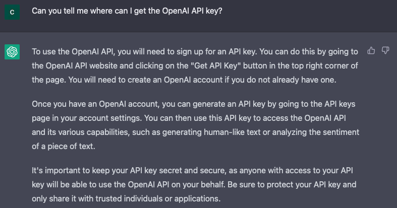
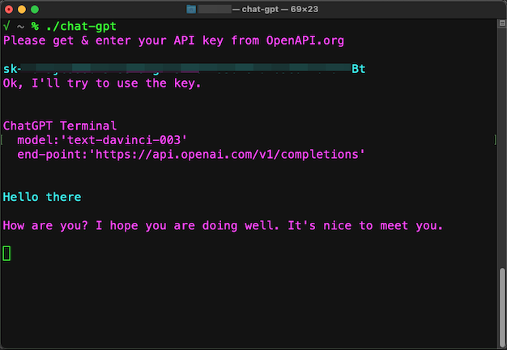
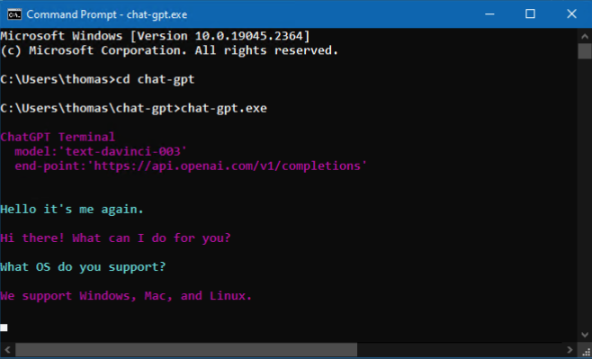

# chat-gpt-console

## A simple app to use ChatGPT in terminal

 
 

### Build from source:

```bash 
> dotnet publish \
  -c Release \
  -r {your CPU type} \ 
  -p:PublishSingleFile=true \ 
  --self-contained true \
  --output publish/{your CPU type}/ ⏎
```
  
whereas *{your CPU type}* is the one of the following values, 

*  osx-arm64: OSX (Apple Silicons M1, M2)
*  osx-x64: OSX (Intel)
*  linux-x64: Linux (Intel)
*  linux-arm64: Linux (ARM)
*  win-x64: Windows (Intel)
*  win-arm64: Windows (ARM)

	
### Download it from the repo:

*  Linux (ARM): [linux-arm64](/publish/linux-arm64/chat-gpt) 
 (SHA256: 93d650b6261b15cb868ef7da38f8855793cf4be830790b597d9c55d65c0f279d)
*  Linux (Intel): [linux-x64](/publish/linux-x64/chat-gpt)
 (SHA256: 7e70361f09718fd5976e47a8c3aca162ff9e72b02d12ce2b3b9020114b1df14d)
 
*  OSX (Apple Silicons M1, M2): [osx-arm64](/publish/osx-arm64/chat-gpt) 
 (SHA256: c9ba93ab46b897ed853d477ac9f41b78e7ce6ffc40635d160f6f911a9ca66b3e)
*  OSX (Intel): [osx-x64](/publish/osx-x64/chat-gpt)
 (SHA256: 5195f737b83b5409a577f95330dfda2c3dd87ea5dbd3e20a0f93fcf41f435c30)

*  Windows (Intel): [win-x64](/publish/win-x64/chat-gpt.exe)
 (SHA256: c0663c2ee48c0de2efb5df5b649f40e668eabd99525a9f70a3766bee32a9f3fe)
*  Windows (ARM): [win-arm64](/publish/win-arm64/chat-gpt.exe)
 (SHA256: 17ee533ac61c9df57111723eaa9becacebc60d9a99d3dd9243b27e7992bb5789)
	
Of couse you will need to give the permission to execute the file

```bash
 > chmod u+x chat-gpt ⏎
 > ./chat-gpt ⏎
```

 
 For Mac, go to 'System Settings -> Privacy & Security',
 Press 'Allow Anyway'
 
 
### How to get your API KEY from OpenAI.org
 
 
 For the first run, it will ask your API KEY, to store it to the 'appsettings.json' like the following.
 
 ```javascript
 {
  "OpenAI": {
    "ApiKey": "{your own OpenAPI key}",
    "Model": "text-davinci-003",
    "EndPoint": "https://api.openai.com/v1/completions"
  }
 }
 ```

### How to setup your own API KEY
 

 
### Run on Windows
 
 
### To do
* Working on mobile app versions'
* Various format of response types (images, links, code blocks, etc.) 


### Disclaimer:

> This software is provided 'as-is', without any express or implied warranty. In no event will the authors be held liable for any damages arising from the use of this software.

> Please note that this software has not been thoroughly tested and may contain bugs or errors. Use at your own risk. The authors make no guarantees or warranties regarding the use or functionality of this software.
